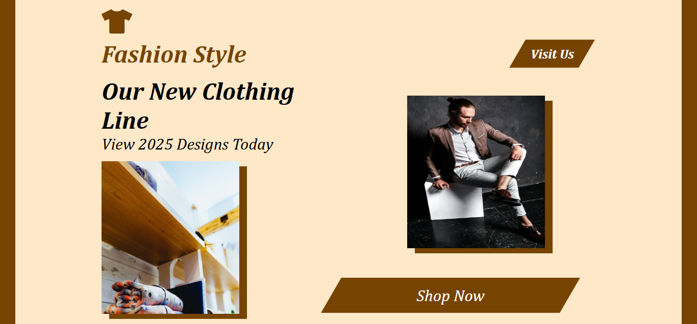

# Fashion Style

A modern, responsive website for **Fashion Style**, a trendy fashion brand. This project highlights a clean layout, interactive elements, and stunning visuals, aimed at delivering a captivating user experience.

---

## Screenshot

  
*Homepage featuring the latest fashion collection.*

---

## Features

- **Logo and Branding**  
  Stylish logo and branding integrated into the header.

- **Modern Design**  
  Clean and elegant layout showcasing the latest clothing lines.

- **Responsive Layout**  
  Optimized for devices of all sizes, ensuring a seamless browsing experience.

- **Font Awesome Icons**  
  Integrated icons add an interactive and modern touch.

- **Dynamic Content**  
  Links and calls to action like "Visit Us" and "Shop Now" provide a user-friendly navigation flow.

---

## Technologies Used

- **HTML5**: Semantic structure for the webpage.
- **CSS3**: Styling for layout, fonts, and images.
- **Font Awesome**: For professional-grade icons.

---