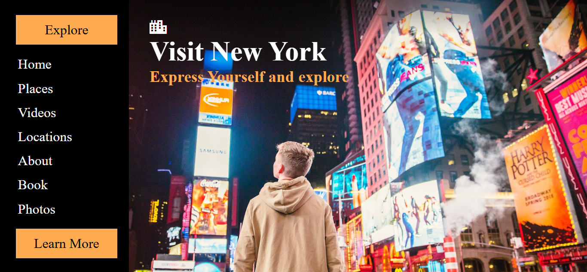

# Tourism Landscape

A modern, responsive website for **Tourism Landscape**, a platform designed to inspire and guide travel enthusiasts. This project includes an interactive layout with a clean design, making it an ideal foundation for tourism-related projects.

---

## Screenshot

  
*Homepage showcasing navigation and branding.*

---

## Features

- **Responsive Navigation**  
  An intuitive navbar and toggle functionality for mobile devices.

- **Modern Design**  
  A clean and professional layout with focus on user experience.

- **Font Awesome Integration**  
  Sleek icons for branding and interactivity.

- **Dynamic Layout**  
  Adaptive content sections, including links to explore places, videos, and more.

---

## Technologies Used

- **HTML5**: Semantic structure of the webpage.  
- **CSS3**: Styling for an engaging user interface.  
- **Font Awesome**: Modern icons for navigation and aesthetics.  
- **JavaScript**: Interactivity for opening and closing the navigation menu dynamically.
