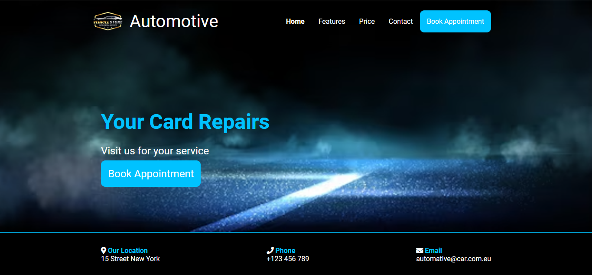

# Automotive Car

A simple website template for a car repair and service business. This project provides a clean and modern layout, helping users learn about services, book appointments, and contact the company.

---

## Screenshot

  
*Homepage featuring navigation and service details.*

---

## Features

- **Responsive Design**  
  Optimized for both mobile and desktop views, ensuring seamless accessibility.

- **Navigation**  
  Easy-to-use menu for quick access to pages like Home, Features, Price, Contact, and Book Appointment.

- **Contact Information**  
  Includes the company's location, phone number, and email for hassle-free communication.

- **Font Awesome Icons**  
  Enhances the user experience with modern and intuitive icons.

---

## Technologies Used

- **HTML5**: For the basic structure of the website.
- **CSS3**: For styling the webpage and creating responsive layouts.
- **Font Awesome**: For adding icons to improve the UI.

---

## Preview

1. Clone the repository:
   ```bash
   git clone https://github.com/your-username/automotive-car.git
