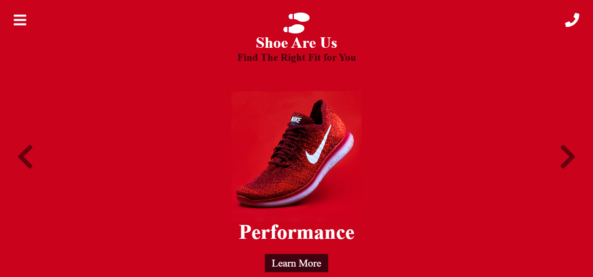

# Shoe Are Us

A modern, responsive website for **Shoe Are Us**, a footwear brand. This project showcases a carousel feature, interactive icons, and a clean layout aimed at providing an engaging user experience.

---

## Screenshot

  
*Homepage with carousel and branding*

---

## Features

- **Interactive Carousel**  
  A visually appealing slider with categories like Performance, Design, Commodity, and Lightness.

- **Responsive Design**  
  Compatible with all devices, ensuring a smooth experience across different screen sizes.

- **Font Awesome Integration**  
  Icons for navigation, logo, and actions enhance the overall design and usability.

- **Dynamic Content**  
  Placeholder links and a carousel layout make this a perfect starting point for footwear-related projects.

---

## Technologies Used

- **HTML5**: Structure and semantics.
- **CSS3**: Styling and layout.
- **Font Awesome**: Icons for a modern look.
- **JavaScript**: To manage interactivity (carousel functionality).