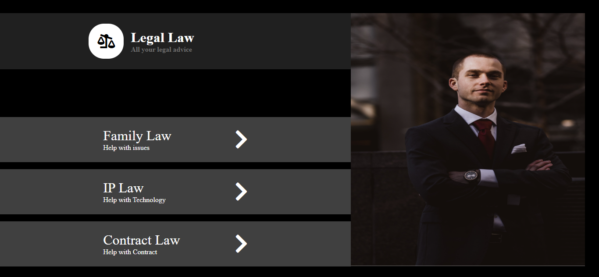

# Legal Law Website

A clean and professional website template for a legal advice service. This project provides an intuitive layout for users to explore various legal topics.

---

## Screenshot

  
*Homepage displaying the legal advice sections and modern layout.*

---

## Features

- **Interactive Links**  
  Provides quick navigation to legal topics such as:
  - Family Law
  - IP Law
  - Contract Law

- **Modern Design**  
  Includes a dark-themed header with a stylish logo and a sidebar image to enhance visual appeal.

- **Font Awesome Icons**  
  Incorporates intuitive icons for a better user interface experience.

---

## Technologies Used

- **HTML5**: For the foundational structure of the website.  
- **CSS3**: For styling and layout enhancements.  
- **Font Awesome**: For modern and responsive icons.  

---