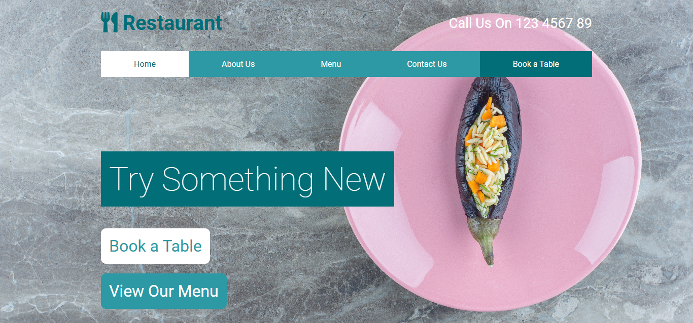

# Restaurant Website

A simple website template for a restaurant. This project provides a clean and modern layout to help users explore services, book reservations, and contact the restaurant effortlessly.

---

## Screenshot

  
*Homepage showcasing the restaurant's features and layout.*

---

## Features

- **Responsive Design**  
  Optimized for both mobile and desktop views, ensuring a seamless browsing experience.

- **Navigation**  
  Easy-to-use menu for quick access to pages like Home, Features, Price, Contact, and Book Appointment.

- **Contact Information**  
  Provides the restaurant's location for convenient navigation and inquiries.

- **Font Awesome Icons**  
  Enhances the user interface with modern and intuitive icons.

---

## Technologies Used

- **HTML5**: For the basic structure of the website.
- **CSS3**: For styling the webpage and creating responsive layouts.
- **Font Awesome**: For adding icons to improve the UI.

---