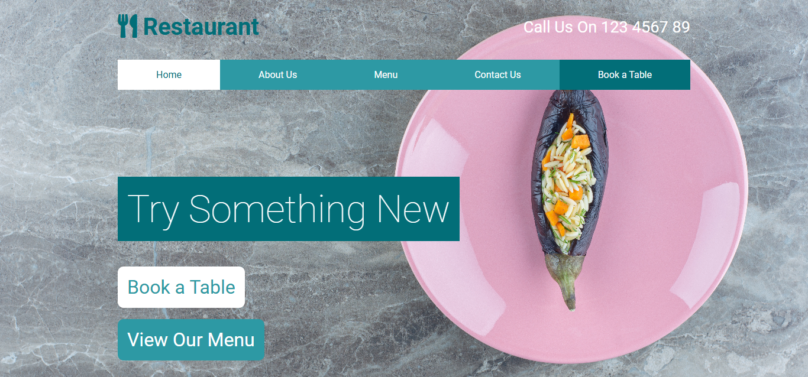

# Restaurant Website

This is a simple website template for a restaurant website. It provides a clean and modern layout for users to learn about the services, book appointments, and contact the restaurant.

## Features

- **Responsive Design**: Optimized for both mobile and desktop views.
- **Navigation**: Easy-to-use navigation menu for quick access to pages like Home, Features, Price, Contact, and Book Appointment.
- **Contact Information**: Includes the restaurant's location.
- **Font Awesome Icons**: Uses Font Awesome icons for a better UI experience.

## Technologies Used

- **HTML5**: For the basic structure of the website.
- **CSS3**: For styling the webpage and creating responsive layouts.
- **Font Awesome**: For adding icons to enhance the user experience.