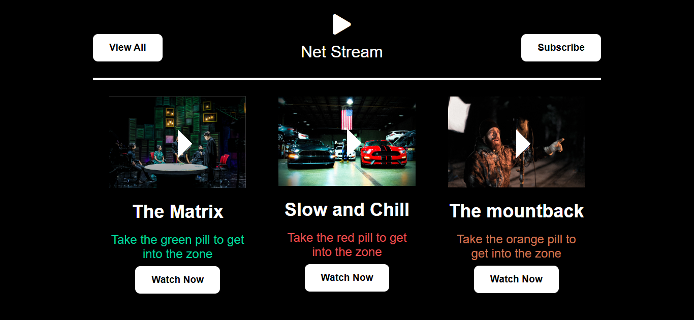

# TV Video Streaming Website  

A modern and engaging website template for a video streaming service. This project highlights popular movie choices with a sleek and user-friendly design.  

---  

## Screenshot  

  
*Homepage showcasing movie cards and a dynamic layout.*  

---  

## Features  

- **Navigation Bar**  
  - Includes "View All" and "Subscribe" buttons for quick access.  
  - A stylish logo featuring a play icon for branding.  

- **Movie Cards**  
  - Displays movies with unique titles, descriptions, and eye-catching posters.  
  - Buttons for instant access to "Watch Now."  

- **Color-coded Zones**  
  - Green, red, and orange pills representing distinct movie themes and genres.  

---  

## Technologies Used  

- **HTML5**: For the website structure.  
- **CSS3**: For styling and layout adjustments.  
- **Font Awesome**: For adding interactive icons.  

---  