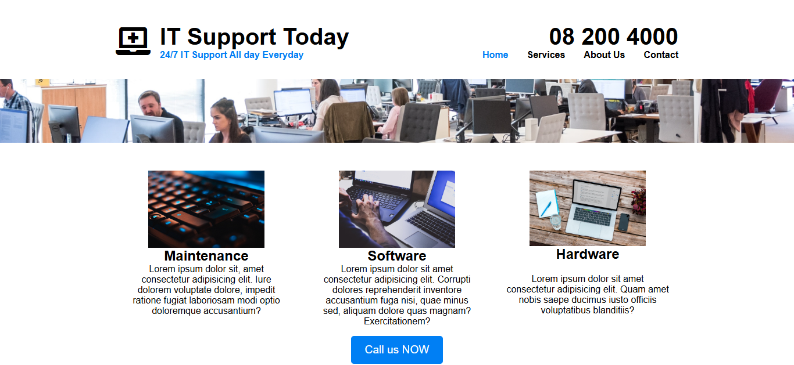

# IT Support Website  

A professional website template for IT support services. This project provides a clean layout to showcase services like maintenance, software, and hardware support, along with easy navigation for users to explore and contact IT professionals.  

---  

## Screenshot  

  
*Homepage showcasing services and a clean navigation menu.*  

---  

## Features  

- **Responsive Navigation Bar**  
  - Includes a logo and navigation links to key pages like Home, Services, About Us, and Contact.  
  - Displays the support contact number and availability message prominently.  

- **Service Cards**  
  - Highlights three main IT services: Maintenance, Software, and Hardware.  
  - Includes descriptive content and service-specific images for clarity.  

- **Call-to-Action Button**  
  - A prominently placed "Call us NOW" button to encourage users to reach out immediately.  

---  

## Technologies Used  

- **HTML5**: For the structural layout of the website.  
- **CSS3**: For styling the webpage, including responsive design elements.  
- **Font Awesome**: For adding modern icons to improve the interface.  
- **JavaScript**: For potential interactivity (deferred for future features).  

---  